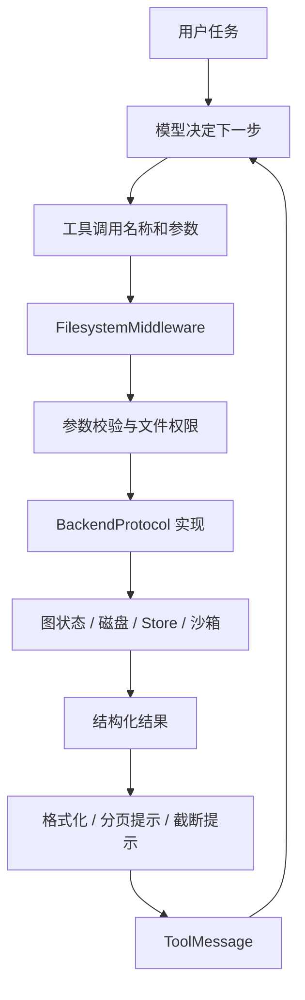

# 01｜从上下文限制到虚拟文件系统

前置知识：会写 Python 函数，知道 LLM 通过工具调用请求执行外部操作，理解一次 `agent.invoke()` 会经过多轮“模型 → 工具 → 模型”。本节不要求提前掌握 LangGraph 源码。

## 1. 问题从哪里来：研究任务不是一次问答

假设研究 Agent 需要读取 30 篇材料，比较三个方案，再生成最终报告。材料原文、工具返回、已经写过的草稿和修改记录都直接进入消息历史，很快就会出现四类问题。

第一，容量不足。系统指令、工具定义、历史消息、新证据、输出预算都要占用上下文窗口。

第二，成本增长。多轮调用中，旧材料可能反复成为输入；即使供应商有缓存，也仍然需要管理延迟、注意力和容量。

第三，检索不精准。模型需要某个方案的一条限制，却要在整段历史中寻找，容易遗漏来源、混淆旧结论。

第四，工作成果难以复用。报告、证据表、原始资料全部混在聊天文本里，没有稳定地址和明确生命周期。

这些问题不是把 `max_tokens` 调大就能全部解决的。更合理的方向是：将完整资料存放在可寻址的外部空间，消息中保留当前工作所需的局部信息。

## 2. “虚拟”到底是什么意思

这里的虚拟文件系统是面向 Agent 的**统一文件操作抽象**：模型使用路径和文件工具，具体实现可以将内容保存到图状态、磁盘、数据库或远程隔离环境。

例如模型发起：

```json
{"name": "read_file", "args": {"file_path": "/sources/design.md", "offset": 20, "limit": 30}}
```

它表达的是“读取这个逻辑地址中的一段内容”，没有指定底层必须是操作系统文件。

| Backend | `/sources/design.md` 的实际意义 |
|---|---|
| StateBackend | 图状态 `files` 映射中的一个键 |
| FilesystemBackend，虚拟模式 | `root_dir/sources/design.md` 对应的真实文件 |
| StoreBackend | 当前 namespace 内的一个 Store 条目 |
| CompositeBackend | 先按路径选后端，再转换为目标后端的路径 |

因此，操作系统 `cat /sources/design.md` 通常无法读取 StateBackend 的文件。`/` 是逻辑命名空间的根，不一定是宿主机根目录。

这也不是 Linux VFS 的完整实现。不要推断它天然支持 inode、文件描述符、POSIX 文件锁、原子重命名、事务或软链接语义。哪些能力存在，必须检查 Backend 协议和具体实现。

## 3. 一次文件操作经过哪些层



### 3.1 模型层：选择行动

模型生成 `tool_calls`，并没有亲自运行 Python 或操作磁盘。模型可能选择错误路径、遗漏参数、忘记检查失败，因此系统不能只依赖提示词约束。

### 3.2 工具与中间件层：面向模型的接口

中间件提供工具描述、输入 Schema、权限判断和返回消息转换。例如工具名叫 `read_file`，底层方法叫 `read`；工具的 `grep` 有 `output_mode`，Backend 返回的是结构化匹配项。

### 3.3 Backend 层：统一存储契约

Backend 实现“如何列目录、如何读取、如何写入”。它应将预期的业务失败转换为结构化错误，例如文件不存在。基础设施异常是否重试、如何记录，需要应用统一设计。

### 3.4 编排与保存层：决定下一轮能否继续

LangGraph 驱动模型与工具循环。Checkpointer 保存图执行状态；Store 提供独立的跨线程数据空间。两者解决的问题不同。

## 4. 消息、State、Checkpoint、Store：不要混为一谈

| 概念 | 主要内容 | 主键/作用域 | 常见误解 |
|---|---|---|---|
| 模型消息 | 当前传给模型的对话和工具结果 | 本次模型请求 | 以为 State 中所有字段都会进入 prompt |
| Graph State | 消息、文件、任务状态等 | 一次图执行及其线程状态 | 以为它天然跨用户共享 |
| Checkpoint | 可恢复的图状态与执行信息 | 线程及检查点标识 | 以为只传 `thread_id` 就已经保存 |
| Store | 独立条目与跨线程数据 | namespace + key | 以为任何 Store 都能抗进程重启 |
| Backend | 对文件操作的实现 | 由实现决定 | 以为 Backend 就等于数据库 |

`StateBackend` 将内容存入 `files`，不意味着模型每轮会看到所有文件。文件需要经工具读回，才形成可见内容。但图状态序列化与检查点仍可能包含大量文件数据：**prompt 变短，不等于系统总存储成本变小。**

采用持久化 Checkpointer 后，StateBackend 的文件可以随同一线程在进程重启后恢复。这不改变它的线程作用域，也不自动让另一个线程访问这些文件。相反，`InMemoryStore` 能被同一进程内的不同线程共享，但重启后并不保留内容。

## 5. 文件系统如何改善上下文工程

一个合理工作流是：

1. 保存原始证据，并分配稳定路径。
2. 用索引文件记录每份证据的主题、来源和用途。
3. 通过 `ls`/`glob` 缩小文件范围。
4. 通过 `grep` 定位关键词与行号。
5. 用 `read_file` 读取必要窗口。
6. 把有依据的中间结论写入笔记。
7. 生成报告并保留来源路径或真实来源链接。

这可以称为逐步披露：先给模型导航信息，再按任务取回细节。设计重点不是“文件越多越好”，而是能否可靠找到正确文件，以及能否明确区分证据、推断和未知事项。

### 5.1 上下文预算的简单模型

设模型输入上限为 `W`，预留输出和安全余量为 `R`，系统与工具定义为 `S`，近期对话为 `H`，本次取回材料为 `D`：

```text
S + H + D <= W - R
```

当已有 80,000 token 的资料，当前任务只需要 2,000 token 的证据时，路径索引和按需读取可以显著减少 `D`。但如果 Agent 每轮又读取全部原文，收益就消失了。

设 `K` 轮调用反复携带全量资料 `D_all`，粗略输入规模为 `K × D_all`。按需读取时则是各轮实际窗口之和 `Σ D_i`，再加导航、工具定义和历史成本。这个模型用于理解增长趋势，不能当作供应商账单公式；缓存、输出和不同工具都会改变实际费用。

### 5.2 为什么不能宣称“无限上下文”

存储容量增加，模型一次能处理的上下文没有改变。问题从“能否放进窗口”变成“能否找对、取对、保持一致”。文件名差、索引过期、错误摘要、检索截断仍然会导致错误答案。

## 6. 和 RAG、长期记忆、缓存的关系

| 能力 | 文件系统方式 | 需要额外组件吗 |
|---|---|---|
| 精确路径读取 | 原生适合 | 通常不需要 |
| 精确关键词定位 | `grep` | 大规模时可能需要索引 |
| 语义相似检索 | 不是 `grep` 的语义 | 需要 embedding/全文/混合检索等 |
| 跨会话保存偏好 | Store/持久磁盘可以承载 | 还需要身份、记忆写入规则和冲突处理 |
| 高频相同查询加速 | Backend 本身不保证 | 需要缓存与失效策略 |
| 证据版本追踪 | 路径本身不够 | 需要版本号、哈希或不可变对象 |

RAG 可以先找相关文档，再把检索片段及原文地址交给 Agent；Agent 文件系统则帮助它继续展开、标注和组织产物。二者可以组合。将资料存进 StoreBackend 也不会自动得到向量检索，内置 `grep` 仍是字面量搜索。

## 7. 中间文件也是系统状态

设任务先写 `/notes/draft.md`，然后读取它生成报告。如果写入失败而模型未察觉，后续报告会基于不存在的产物。若另一任务覆盖草稿，后续读到的内容可能并非原版本。

因此工程上需要：

- 检查每次工具结果，而不是只看最终自然语言答复。
- 写后读回关键产物，必要时计算哈希。
- 用任务目录和唯一标识区分并发工作。
- 发布最终报告前进行内容验证和版本固定。
- 将长期事实写入和短期草稿写入区分处理。

## 8. 本节自测

**问题 1：给 Agent 配置了 StateBackend，为什么第二次 `invoke` 看不到文件？**

先检查是否使用 Checkpointer、是否沿用相同线程，以及是否显式传回了完整所需状态。Backend 类名本身不提供外部会话保存服务。

**问题 2：换成磁盘后，为什么不同线程能看到同一文件？**

因为文件可见性由磁盘根目录决定，`thread_id` 不会自动改写路径。需要按任务/租户配置独立根目录或受控路由。

**问题 3：文件自动卸载了，为什么成本还在增加？**

可能存在反复读回、文件状态被反复检查点保存、摘要调用、搜索扫描以及模型输出增长。必须分开观察模型成本、存储成本和工具成本。

下一节：[工具与 Backend 语义](02-tools-and-backends.md)。具体 API 的证据入口见 [来源与验证](09-references-and-validation.md)。
