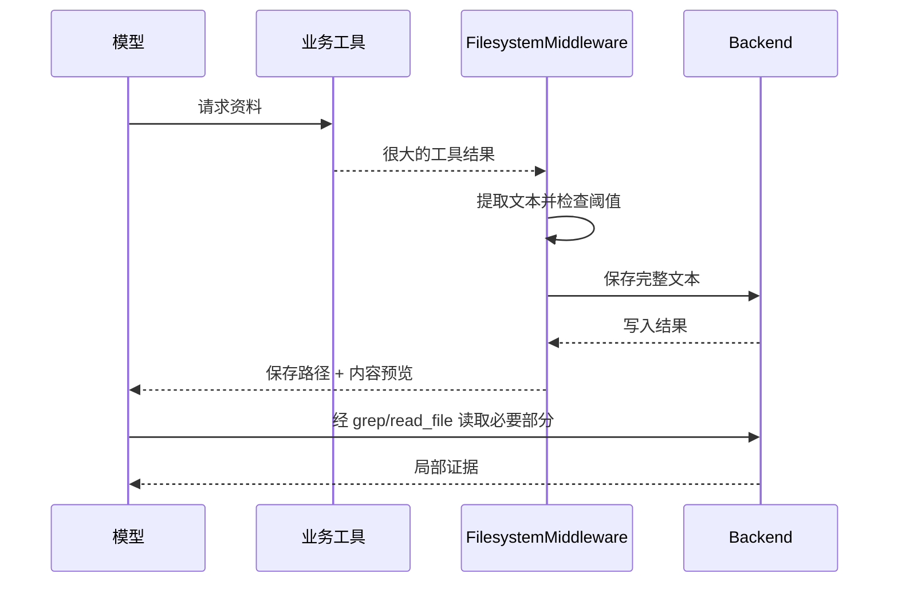

# 05｜自动卸载、摘要与上下文预算实验

本节为选学内容，所有实验使用独立 `.py` 文件。先运行实验 08 看自动卸载，再按需要学习摘要与容量设计。无需复制任何公共实验代码。

## 1. 不同机制处理不同问题

| 机制 | 触发对象 | 主要作用 | 不能保证的事情 |
|---|---|---|---|
| 手动写证据文件 | 应用或模型主动写入 | 提供稳定资料地址 | 不会自动筛选正确证据 |
| 分页读取 | 某个读取请求 | 限制单次取回量 | 不保证跨页快照一致 |
| 大工具结果卸载 | 超过阈值的工具输出文本 | 用引用替代大段输出 | 不自动缩小 State/数据库总体积 |
| 大用户消息卸载 | 很大的用户文本 | 减少模型请求的文本压力 | 不代表原消息从所有存储中删除 |
| 旧工具参数裁剪 | 历史工具参数 | 降低旧调用在上下文中的负担 | 不等于所有参数都完整转存 |
| 对话摘要 | 较长的历史 | 保留继续任务所需的信息 | 有损，可能遗漏约束和证据 |

不要把它们统一描述成“输入输出超过 20K 就自动完整保存”。`0.7.14` 的工具结果卸载阈值默认是 20,000，但这一条路径使用 `4 × 阈值` 的字符数近似；它不是调用模型 tokenizer 计算出来的精确 token 数。大用户消息另有默认 50,000 的阈值配置，旧工具参数又是不同机制。

对于中文、代码、表情和混合内容，字符数近似与真实 token 数可能偏差明显。阈值是策略参数，不是模型硬上限。

## 2. 自动卸载的真实数据流



默认工具结果目录位于 `/large_tool_results/`；Composite 的 `artifacts_root` 可以改变前缀。文件名包含调用标识等实现细节，应用不应该猜一个固定文件名。工具回复中的真实引用是导航依据。

当前预览含头部和尾部片段，不应背成“永远只显示前 10 行”。多模态内容中，文本卸载与非文本内容保留也需要分开理解。

文件工具本身在通用卸载排除列表中，包括 `read_file`、`grep` 等；它们有各自的分页或输出限制。否则读取一份卸载文件，又把读取结果卸载成新文件，会产生循环引用。

## 3. 实验 08：大正文变成路径与预览

独立脚本：[08_large_result.py](../code/08_large_result.py)。

```bash
.venv/bin/python lessons/ch03/code/08_large_result.py
```

本实验只调用一次返回大文本的工具。观察五行输出：原文本长度、工具消息长度、工具消息预览、保存路径，以及“保存内容等于原文”的比较结果。

本次实测为 47,389 个字符的正文，替代 ToolMessage 为 1,629 个字符。完整正文保存在 StateBackend 中；缩短的是工具消息。数字与当前预览规则有关，不是通用压缩比，也不是 token 或费用。

### 3.1 先看现象，再看固定模型

`FixedToolModel` 复用框架已有的测试模型，只补充工具绑定方法。它按 responses 播放“调用 get_material”和“结束”两条消息，不访问供应商。工具执行和中间件卸载是真实的。这段辅助代码仅在选学实验出现，前六个实验不需要学习它。

### 3.2 为什么配置 FilesystemMiddleware

`create_deep_agent` 内置该中间件。当前版本会用同名实例替换默认实例，本例借此降低阈值。中间件和 Agent 使用同一个 Backend，确保保存位置一致。

### 3.3 保存了全文，是否等于模型已经读懂全文

不是。它还需要通过引用路径调用 read_file/grep 才能查看未进入预览的部分。若文件已清理、线程切换或存储故障，引用可能失效。实验验证保存完整性，不宣称验证了真实模型的主动检索能力。

## 4. 自动摘要：压缩的是信息表示，不是事实风险

摘要需要保留任务目标、用户约束、已完成操作、关键结论及依据、产物位置、未完成工作。只保留“我们研究了缓存”无法支持下一轮可靠继续。

本版本默认摘要策略依赖模型 profile：已知 `max_input_tokens` 时，常用触发阈值为窗口的 85%，近期保留窗口为 10%；profile 缺失时，源码使用固定 token/消息回退配置，包括 170,000 token 的摘要触发值。不能假定所有自定义模型都会自动按它真实的小窗口大小触发。

摘要、工具参数裁剪和结果卸载的具体执行顺序由中间件控制。原课程中简化的“两道防线”适合入门理解，不应当作所有版本的严格状态机规范。

## 5. 进阶实验 12：验证摘要的归档与继续执行机制

本实验刻意使用固定摘要模型，测试中间件能否执行和归档，不测试摘要语言质量。主模型与摘要模型都不访问外部服务。

独立脚本：[12_summarization.py](../code/advanced/12_summarization.py)。

```bash
.venv/bin/python lessons/ch03/code/advanced/12_summarization.py
```

脚本使用很小的消息数触发阈值，连续发送八轮消息。观察输出中的 `/conversation_history/` 归档路径，并验证第一轮原文仍在归档里。这是进阶选学，不是理解 Backend 的前置条件。


这个实验不应通过 `len(result["messages"])` 单独推断“真实模型输入缩短了多少”。图中的保存状态、摘要事件和最终送给模型的请求视图可能不同；要测模型输入，需在模型调用处记录实际请求内容或 token usage。

### 5.1 真实摘要质量如何测

创建含明确约束的多轮对话，例如“不得使用外网”“报告必须引用两个文件”“第一版结论已被后续证据否定”。在摘要前后分别问同一组问题，比较约束保留率、事实正确率和产物可定位率。

摘要只能作为导航和工作记忆。对关键数值、权限、用户批准和不可逆操作，应该查权威状态或原始证据，不能仅凭摘要推断。

## 6. 膨胀会转移到哪里

把 5 MB 文本从 ToolMessage 搬到 StateBackend 的 `files`，可能减少模型请求中的正文，但这些内容仍需保存在图状态。若检查点频繁、文件重复改写，序列化、内存和存储压力会增长。实际是否去重以及如何增量保存取决于 Checkpointer。

长期大型原文通常更适合外部对象/文件存储；State 中保存任务所需引用和少量中间状态。检索索引可以单独维护，前提是索引与原文版本一致。

## 7. 一份可执行的上下文预算策略

对于研究任务，可以采用以下应用策略，而非仅依赖自动触发阈值：

1. 每份原始资料保存来源、抓取时间、内容哈希和可信等级。
2. 原文入库后生成短索引，索引只负责导航。
3. 每轮限制取回文件数、窗口行数与估算 token。
4. 搜索截断时先缩小范围，再查询，而不是盲目放大返回上限。
5. 关键结论必须关联来源路径和版本；总结时保留关联。
6. 任务结束后固化报告与证据版本，再清理无引用的临时产物。

## 8. 评估指标与反例

| 指标 | 定义示例 | 易产生的误判 |
|---|---|---|
| 引用可解析率 | 能成功打开的引用 / 全部引用 | 文件存在但内容已被覆盖 |
| 证据支持率 | 确实被证据支持的断言 / 抽样断言 | 引用了同主题文档就算支持 |
| 检索召回 | 找回的关键证据 / 已知关键证据 | 用所有返回行数替代关键证据数量 |
| 分页完整性 | 没有遗漏/重复的源行或记录比例 | 只验证第一页 |
| 模型输入规模 | 实际请求 token usage | 把字符数直接叫作 token |
| 存储放大 | 总保存字节 / 唯一原文大小 | 忽略检查点、备份和历史版本 |
| 任务完成率 | 达到验收条件的任务占比 | 模型说“完成”就计为通过 |

下一节：[生产设计与自定义扩展](06-production-and-customization.md)。
